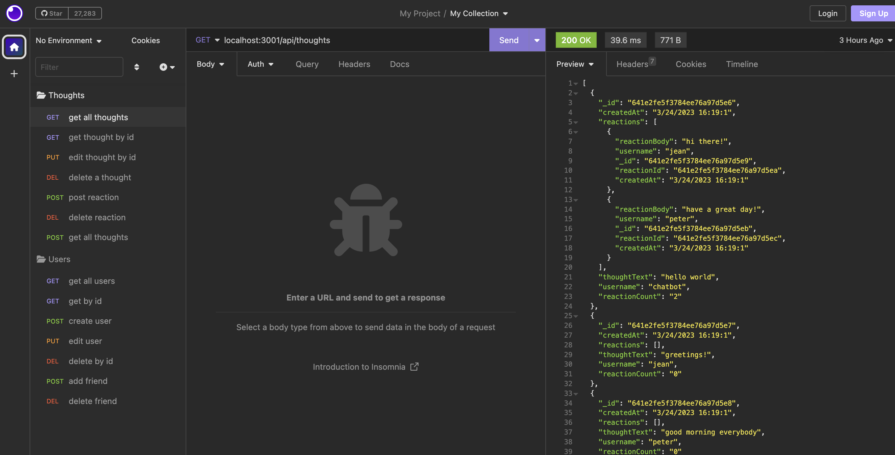
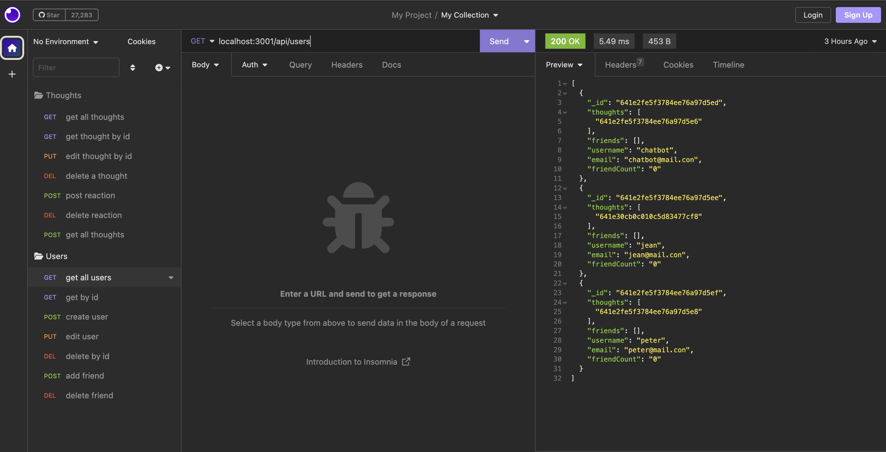

# 18 NoSQL: Social Network API

## User Story

```md
AS A social media startup
I WANT an API for my social network that uses a NoSQL database
SO THAT my website can handle large amounts of unstructured data
```

## Acceptance Criteria

```md
GIVEN a social network API
WHEN I enter the command to invoke the application
THEN my server is started and the Mongoose models are synced to the MongoDB database
WHEN I open API GET routes in Insomnia for users and thoughts
THEN the data for each of these routes is displayed in a formatted JSON
WHEN I test API POST, PUT, and DELETE routes in Insomnia
THEN I am able to successfully create, update, and delete users and thoughts in my database
WHEN I test API POST and DELETE routes in Insomnia
THEN I am able to successfully create and delete reactions to thoughts and add and remove friends to a user’s friend list
```

## Installation

Run `npm i` in the project directory.

Then run `npm run seed` in order to seed the data into the database.

## Usage

Open insomnia in order to view the data. Run `node index.js` to start the server and start making your calls!




Link to Demo: https://watch.screencastify.com/v/frbVMAQtjdCKcjZOWlTf

## Contributing

N/A

## License

N/A
